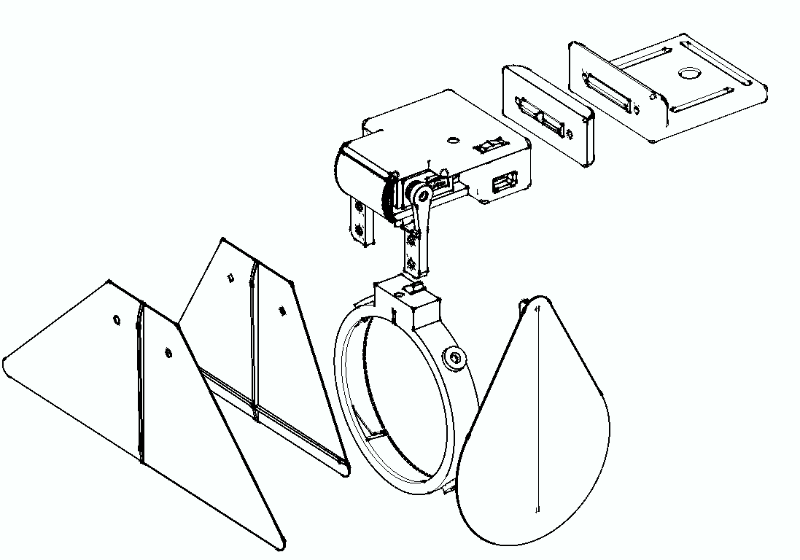

# THE [ a n y m a ] SHUTTER

Versatile, modular 3D-printed, motorized, remote controlled shutter for video beamers and other light sources.

- Can be mounted to the projector in various ways. 
- Wireless remote control through ESP-Now over ~25m.
- DMX input to the remote, no need to install cables
- Test button on the device

◊

